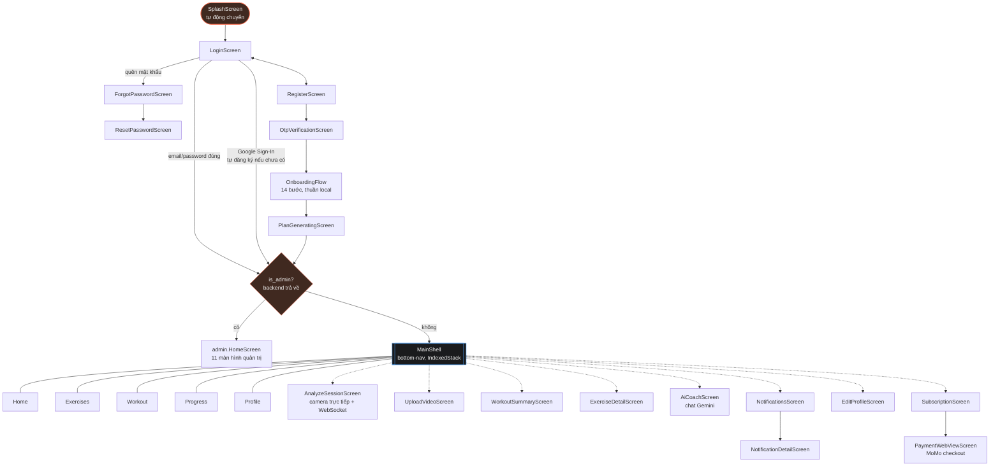
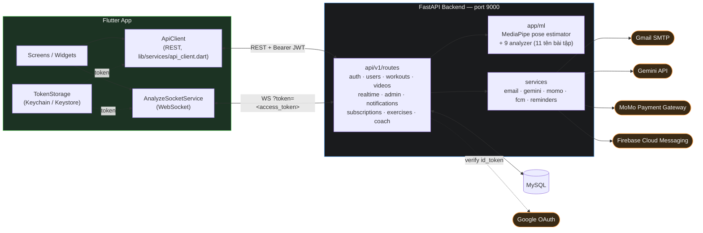

# Sơ đồ tổng quan PostureX

Hai flowchart: (1) toàn bộ màn hình Flutter và đường điều hướng giữa chúng,
(2) kiến trúc hệ thống nhìn từ trên xuống. Lấy trực tiếp từ [CLAUDE.md](../CLAUDE.md)
(mục Navigation/Architecture) — xem file đó để có chú thích chi tiết hơn.

## 1. Luồng màn hình & điều hướng

Không dùng router package nào (không go_router/auto_route), không named
route — toàn bộ điều hướng bằng `Navigator.push`/`pushReplacement` thuần.
Đường nét đứt (`-.->`) = màn hình chỉ mở được từ trong `MainShell`, không
nằm trong 5 tab chính.

## 2. Kiến trúc hệ thống

**Ghi chú:**
- `ApiConfig` (`lib/config/api_config.dart`) chọn host theo 2 lớp: build-time
  `--dart-define=API_BASE_URL=…` nếu có, không thì tự suy ra
  `10.0.2.2:9000` (Android emulator) hoặc `localhost:9000`.
- WebSocket là endpoint duy nhất xác thực qua **query param** `token=`
  thay vì header `Authorization` (xem [docs/COMMUNICATION.md](COMMUNICATION.md) mục 4).
- `ML` (MediaPipe + analyzer) chạy **trong tiến trình backend**, không phải
  service tách riêng — mỗi frame WebSocket được xử lý đồng bộ ngay trong
  route handler.
- MoMo/Gemini/FCM đều optional — thiếu key thì tính năng liên quan tắt êm
  (MoMo trả 503 có chủ đích, FCM bỏ qua push trong im lặng), không crash app.
