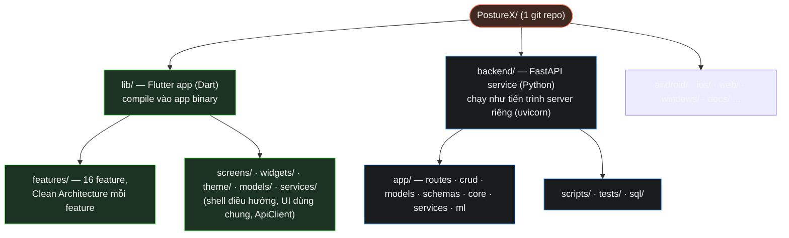
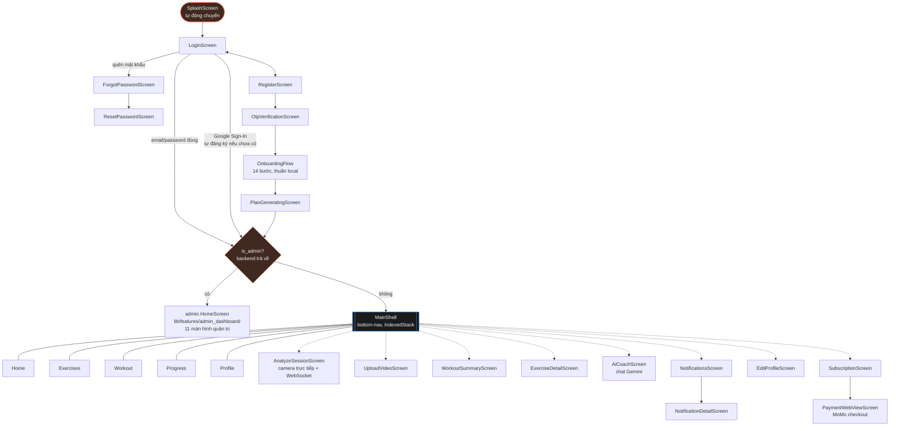
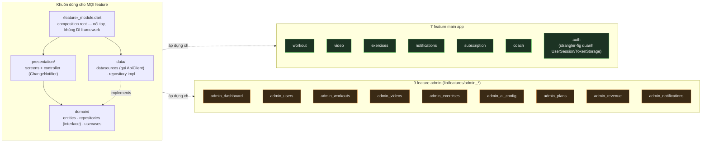
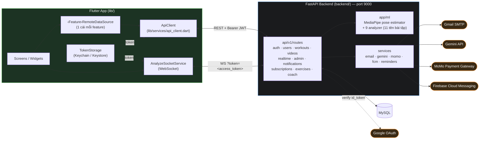

# Sơ đồ tổng quan PostureX

Bốn phần: (1) bố cục repo — Flutter và backend là 2 thư mục ngang hàng, (2)
toàn bộ màn hình Flutter và đường điều hướng giữa chúng, (3) Clean
Architecture áp dụng cho 16 feature Dart, (4) kiến trúc hệ thống nhìn từ
trên xuống. Lấy trực tiếp từ [CLAUDE.md](../CLAUDE.md) — xem file đó để có
chú thích chi tiết hơn.

## 1. Bố cục repo

Hai thư mục ngang hàng vì đây là **hai runtime hoàn toàn khác nhau** — Dart
biên dịch thành app, Python chạy như server độc lập — chúng chỉ nói chuyện
qua REST/WebSocket, không có quan hệ import nào. `backend/` từng nằm lồng ở
`lib/backend/`; đã dời ra gốc repo vì `lib/` vốn chỉ dành cho Dart và việc
lồng vào không có lợi ích gì.

## 2. Luồng màn hình & điều hướng

Không dùng router package nào (không go_router/auto_route), không named
route — toàn bộ điều hướng bằng `Navigator.push`/`pushReplacement` thuần.
Đường nét đứt (`-.->`) = màn hình chỉ mở được từ trong `MainShell`, không
nằm trong 5 tab chính. `admin.HomeScreen` vẫn đúng bí danh import
(`as admin`) — khu quản trị không phải app riêng, chỉ là các màn hình khác
trong cùng 1 `main()`, giờ nằm dưới `lib/features/admin_*/`.

## 3. Clean Architecture — 16 feature Dart

`AppFailure` (`lib/core/errors/failures.dart`, sealed class với
`NetworkFailure`/`ServerFailure`) là kiểu lỗi domain-layer dùng chung cho cả
16 feature, tách biệt khỏi `ApiException` (data-layer). Phần chưa migrate:
shell điều hướng (`MainShell`, `Splash/Home/Profile screen`), `UserSession`
tĩnh, `TokenStorage`, `lib/theme/`, `lib/widgets/` — những thứ mang tính hạ
tầng dùng chung, không thuộc về 1 feature cụ thể nên vẫn ở nguyên vị trí cũ.

## 4. Kiến trúc hệ thống

**Ghi chú:**
- Chiều gọi thật là `Screen → RemoteDataSource → ApiClient` (qua use case +
  repository ở giữa) — UI không gọi thẳng `ApiClient.instance` nữa như
  trước migrate, mỗi feature có 1 `RemoteDataSource` riêng bọc quanh
  `ApiClient`.
- `ApiConfig` (`lib/config/api_config.dart`) chọn host theo 2 lớp: build-time
  `--dart-define=API_BASE_URL=…` nếu có, không thì tự suy ra
  `10.0.2.2:9000` (Android emulator) hoặc `localhost:9000`.
- WebSocket là endpoint duy nhất xác thực qua **query param** `token=`
  thay vì header `Authorization` (xem [docs/COMMUNICATION.md](COMMUNICATION.md) mục 4).
- `ML` (MediaPipe + analyzer) chạy **trong tiến trình backend**, không phải
  service tách riêng — mỗi frame WebSocket được xử lý đồng bộ ngay trong
  route handler.
- MoMo/Gemini/FCM đều optional — thiếu key thì tính năng liên quan tắt êm
  (MoMo trả 503 có chủ đích, FCM bỏ qua push trong im lặng), không crash app.
