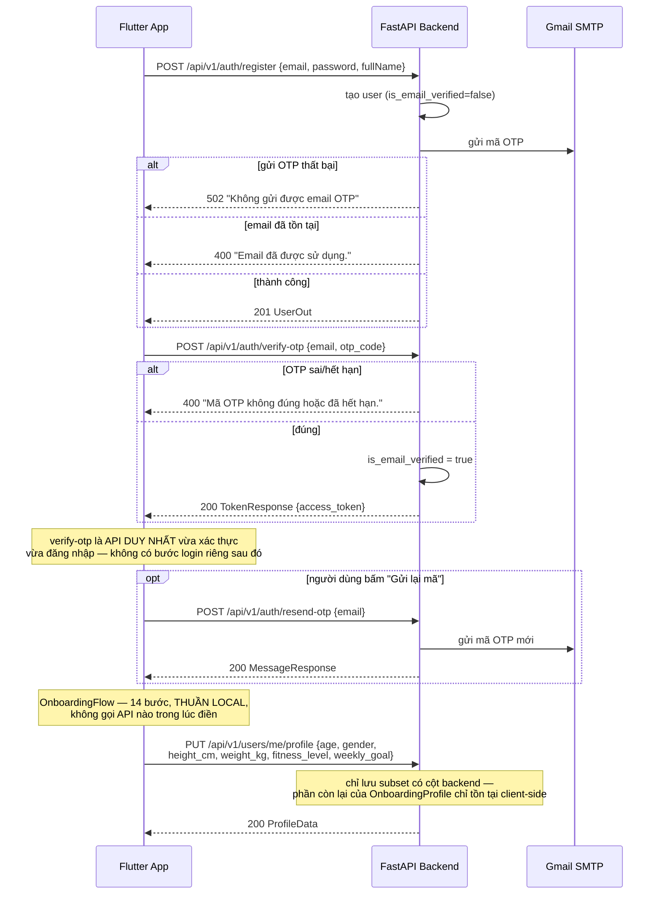
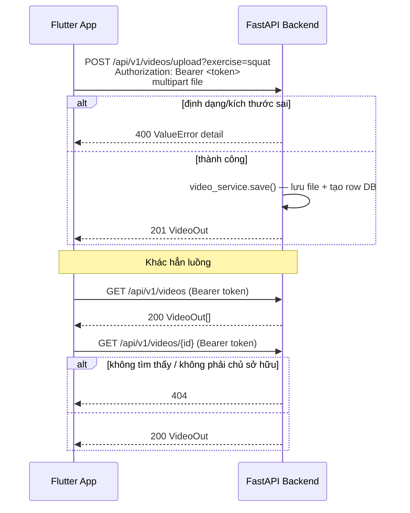
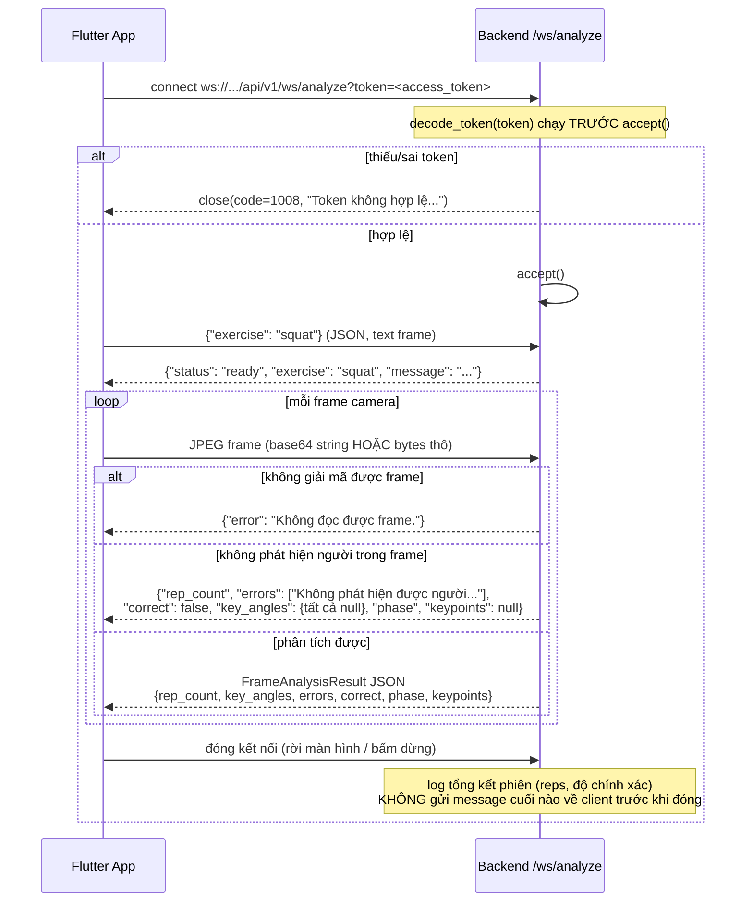

# Giao tiếp Flutter ⇄ Backend

Tài liệu này mô tả **thực tế** 4 luồng giao tiếp chính giữa app Flutter và
backend FastAPI — method, path, status code, và thứ tự message — lấy trực
tiếp từ code (`app/api/v1/routes/*.py`, `lib/services/api_client.dart`,
`lib/services/analyze_socket_service.dart`), không phải thiết kế trên giấy.

Mục đích: đọc hiểu "ai gửi gì cho ai, lúc nào" mà không cần chạy app hay
Postman. Base URL xem [lib/config/api_config.dart](../lib/config/api_config.dart)
(`http://localhost:9000` khi dev, override bằng `--dart-define=API_BASE_URL=...`
lúc build production).

---

## 1. Đăng ký + xác thực OTP

`RegisterScreen` → `OtpVerificationScreen` → `OnboardingFlow` (local) →
`PlanGeneratingScreen` → `MainShell`.

---

## 2. Đăng nhập (thường + Google)

```mermaid
sequenceDiagram
    participant App as Flutter App
    participant API as FastAPI Backend
    participant Google as Google OAuth

    rect rgb(30, 30, 35)
    Note over App,API: Đăng nhập thường
    App->>API: POST /api/v1/auth/login {email, password}
    alt sai email/mật khẩu
        API-->>App: 401 "Email hoặc mật khẩu không đúng."
    else chưa xác thực email
        API-->>App: 403 "Email chưa được xác thực..."
    else thành công
        API-->>App: 200 TokenResponse {access_token}
    end
    end

    rect rgb(30, 30, 35)
    Note over App,Google: Đăng nhập Google — 1 lệnh vừa login vừa register
    App->>Google: GoogleSignIn (SDK, không qua backend)
    Google-->>App: id_token
    App->>API: POST /api/v1/auth/google {id_token}
    API->>Google: verify id_token (server-side, không tin client)
    Google-->>API: idinfo {email, email_verified, name}
    API->>API: tạo user mới nếu email chưa có
    API-->>App: 200 TokenResponse {access_token, is_new_user}
    Note over App: is_new_user=true → có thể cần đẩy qua Onboarding
    end
```

---

## 3. Upload video buổi tập

---

## 4. Phiên phân tích tư thế realtime (WebSocket)

`AnalyzeSessionScreen` → `AnalyzeSocketService`. Xem
[backend/app/api/v1/routes/realtime.py](../backend/app/api/v1/routes/realtime.py).

**Điểm dễ nhầm:**
- Đây là endpoint duy nhất dùng token qua **query param**, không phải header
  `Authorization` — vì WebSocket handshake trên nhiều client (kể cả web)
  không set header tuỳ ý được lúc connect.
- `ANALYZER_REGISTRY` trong `realtime.py` hiện chỉ map ~10 bài tập cụ thể;
  tên bài tập không khớp sẽ tự fallback về `SquatAnalyzer` (log warning,
  không báo lỗi cho client).
- Không có message "kết thúc phiên" nào gửi về app — `WorkoutSummaryScreen`
  tự tổng hợp từ dữ liệu đã nhận được qua các frame trước đó, không đợi
  server gửi thêm gì sau khi đóng socket.
